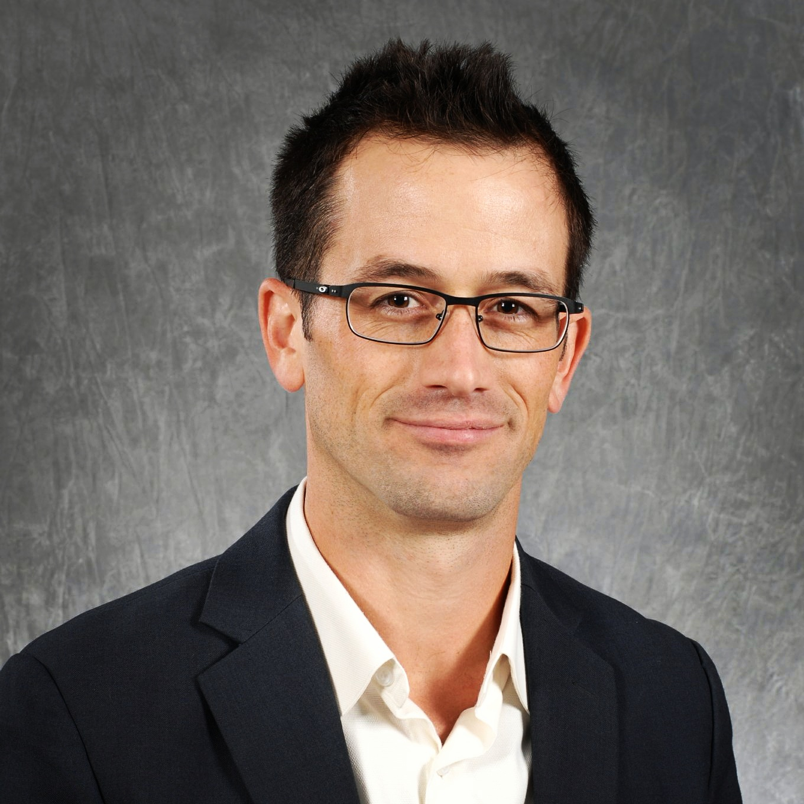

```{r setup, include=FALSE}
knitr::opts_chunk$set(echo = TRUE)
```

\begin{flushright}

```{r, out.width = "2in", echo=FALSE}

```

\end{flushright}


$~$

**Date:** April 16, 2017

$~$

$~$

Contributors to the Deboch Memorial Graduate Fellowship

Washington State University

Pullman, WA 99164

$~$

Dear Contributors to the Deboch Memorial Graduate Fellowship:

I'm truly honored to receive the Deboch, Tesfaye Girma Memorial Graduate Fellowship in Tesfaye Deboch's name. For me receiving this fellowship means more than much appreciated financial support, it is also a vote of confidence from the CAHNRS award committee and a message that the college considers me a valuable member of the community.

But I'm also thankful to receive this specific scholarship because until writing this letter I was not aware of Tesfay Girma Deboch's story. The loss of this graduate student is tragic, and the establishment of a memorial scholarship in his name feels especially generous and important to me. I'll work hard to use these funds in a way that uphold its goals and Deboch's name.

One of my primary research interests is the economics of scarce resources, and this fellowship will help provide the resources needed to study these issues on site when possible.

For two years I lived in West Africa as a Peace Corps volunteer. That time taught me a lot about myself and about the cares and concerns common to all of humanity. I hope that in my time as a PhD student at WSU and in my career afterward, I can keep those lessons with me to inform my research and other economic work.

$~$

All of my best, and in sincere appreciation,

$~$

$~$

Nicholas Potter

